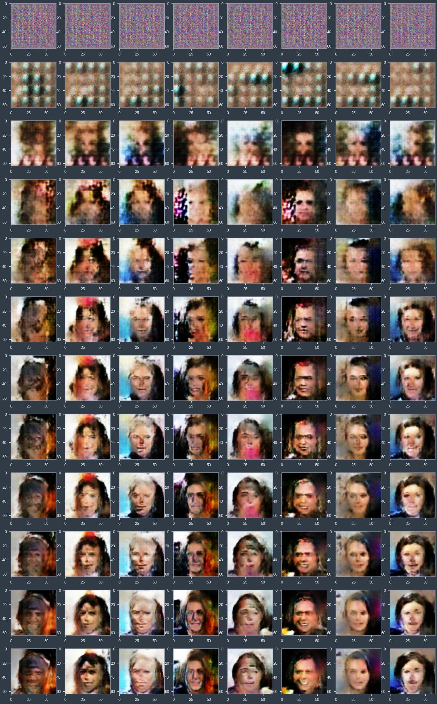

# GAN-Pytorch
**These GAN algorithms implemented in Pytorch, illustrated in Jupyter Notebook**
- Wasserstein GAN
- Progressive GAN

The purpose if this notebook is you can go from block to block, undertand how GAN is implemented and how it operates. So it has more education purpose than production value.

 

 The progress of Wasserstein GANS 

**Instruction**
- Download CelebA dataset (https://mmlab.ie.cuhk.edu.hk/projects/CelebA.html) and place it in data folder 
- Run notebook cell by cell

References:
- Wasserstein GAN https://arxiv.org/abs/1701.07875
- Progressive GAN https://arxiv.org/abs/1710.10196
